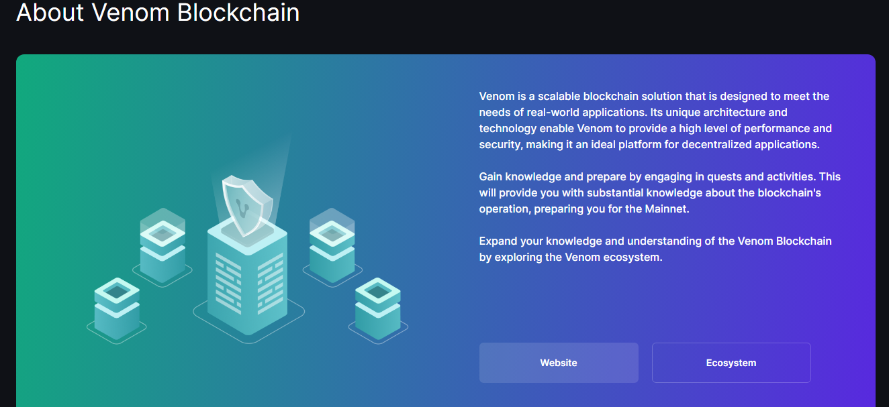

## Scenario

#### Beginning
1. Operator creates a wallet on the Venom network
2. Operator creates its own DAO by deploying the `AssetFactory` contract
3. Operator adds to the whitelist (inside `AssetFactory` `addAuditor()` function) auditors.

#### Issue of a New Asset
1. `User` (regular wallet) chooses an auditor off-chain, asks the `Auditor` to create an asset.
2. `User` and `Auditor` off-chain agree on the parameters of the asset (initial emission, asset name, symbol).
3. `Auditor` creates an asset through the factory (calls `deployRoot()` in the `AssetFactory` contract).
4. `Auditor` transfers the initial issue to the `User`.

#### Next Steps
- `User` have the ability to offset their carbon footprint by burning assets.
- As `User` produces green energy, he can agree with the `Auditor` on the proportional issue of tokens to User’s account.

---


## Steps to deploy the contract

```
npm install 

npm install -g locklift
```

---
Build & Run:
npx locklift build
```
npx locklift run -s scripts/1-deploy-assetFactory.ts -n test
```
---
Document:
https://docs.venom.foundation/build/quick-start-on-testnet

---

